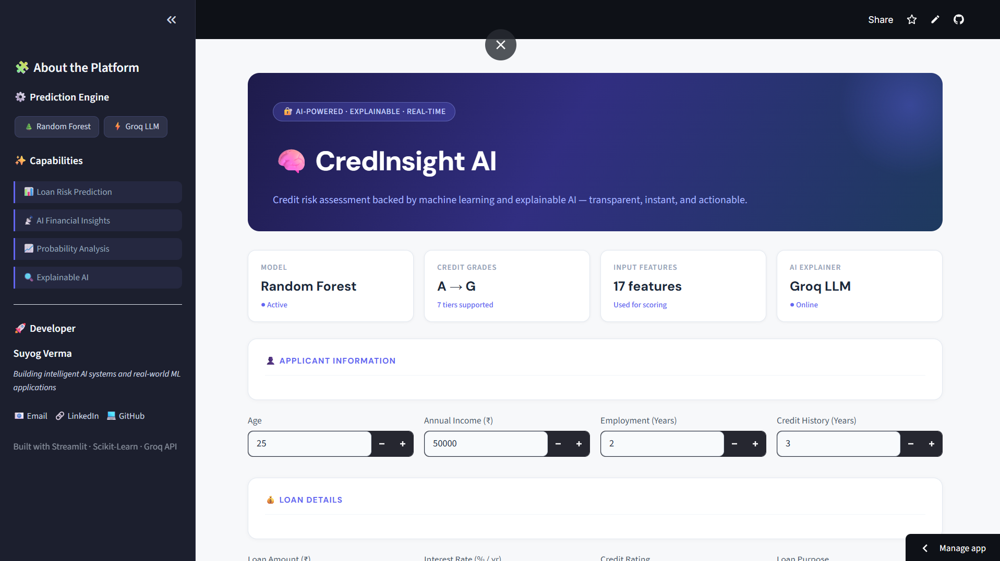

# 🧠 CredInsight AI

An AI-powered credit risk assessment platform that combines machine learning, explainable AI, and LLM-based financial analysis to evaluate loan applicants in real time.

## 🚀 Live Demo

https://credinsight-ai.streamlit.app/

---

## 📌 Features

* 📊 Credit Risk Prediction
* 🧠 AI Financial Analysis
* 📈 Risk Probability Scoring
* 🔍 Explainable AI Insights

---

## 🛠️ Tech Stack

### Machine Learning

* Scikit-Learn
* Random Forest Classifier
* Pandas
* NumPy

### AI Integration

* Groq API
* Llama 3.1

### Frontend & Deployment

* Streamlit
* Custom CSS
* Streamlit Community Cloud

---

## 💡 Project Overview

CredInsight AI is designed to simulate intelligent financial risk analysis by combining traditional machine learning with large language models.

The platform predicts the likelihood of loan default while also generating human-readable AI explanations for financial decision-making.

This project focuses on:

* Explainable AI
* Financial analytics
* Intelligent prediction systems
* Real-world ML deployment

---

## 👨‍💻 Developer

**Suyog Verma**

Focused on building intelligent AI systems and real-world machine learning applications.

* LinkedIn - https://www.linkedin.com/in/suyog01/
* GitHub - https://github.com/commit-msuyog
* Email - suyogverma0057@gmail.com

---

## 📸 Screenshots

### Dashboard

### AI Financial Analysis

---

## 📈 Future Improvements

* SHAP Explainability
* PDF Financial Reports
* Advanced Risk Visualizations
* Database Integration
* Multi-model Risk Analysis
